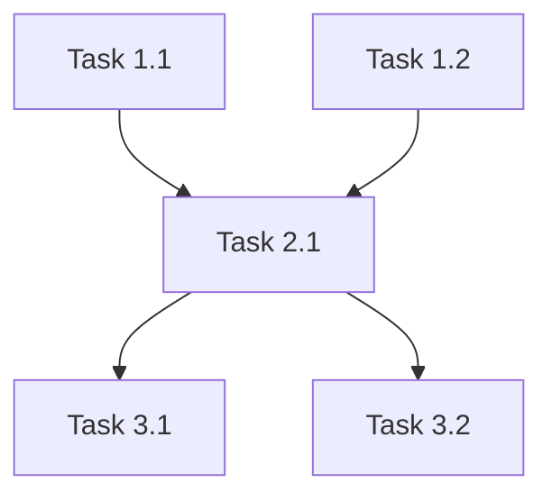

# Decompose — Task Decomposition

Breaks complex tasks into atomic, executable subtasks.

## Workflow

### Step 1: Understand the Task

Read the user's request and any related files. If the task is ambiguous, use `AskUserQuestion` to clarify:

```json
{
  "questions": [
    {
      "question": "What granularity do you need?",
      "header": "Granularity",
      "options": [
        {"label": "Coarse (Recommended)", "description": "5-10 high-level subtasks, each ~1 agent session"},
        {"label": "Fine", "description": "10-30 atomic tasks, each ~1 function or file change"},
        {"label": "Sprint-sized", "description": "Grouped into workable chunks with effort estimates"}
      ],
      "multiSelect": false
    }
  ]
}
```

### Step 2: Decompose

Dispatch **planner** (Opus) to decompose the task:

1. Identify the major components of the task
2. For each component, break into subtasks
3. For each subtask, determine:
   - Description (specific and actionable)
   - Agent type and tier
   - Dependencies (what must complete first)
   - Parallel group (what can run simultaneously)
   - Estimated complexity (1-10)

### Step 3: Output Decomposition

```markdown
## Task Decomposition: [Original Task]

### Dependency Graph


### Parallel Groups

**Group 1** (can run simultaneously):
| # | Task | Agent | Tier | Complexity |
|---|------|-------|------|------------|
| 1.1 | [Task] | [agent] | [tier] | [1-10] |
| 1.2 | [Task] | [agent] | [tier] | [1-10] |

**Group 2** (depends on Group 1):
| # | Task | Agent | Tier | Complexity |
|---|------|-------|------|------------|
| 2.1 | [Task] | [agent] | [tier] | [1-10] |

### Total Estimates
- Subtasks: [N]
- Parallel groups: [N]
- Estimated total complexity: [Sum]
- Tier distribution: Opus [N] / Sonnet [N] / Haiku [N]
```
