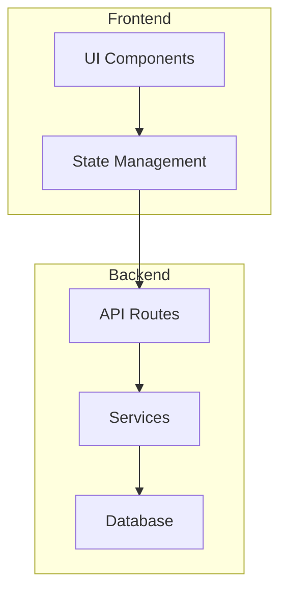

# Deep Init — Hierarchical Documentation Generation

Analyzes the codebase and generates comprehensive, structured documentation.

## Workflow

### Step 1: Choose Documentation Scope

Use `AskUserQuestion`:

```json
{
  "questions": [
    {
      "question": "What documentation do you need?",
      "header": "Docs Type",
      "options": [
        {"label": "README (Recommended)", "description": "Project overview, setup, usage, and contribution guide"},
        {"label": "Architecture", "description": "System design, component diagrams, data flow documentation"},
        {"label": "API docs", "description": "Endpoint specifications with request/response examples"},
        {"label": "Full suite", "description": "README + Architecture + API docs + CHANGELOG"}
      ],
      "multiSelect": false
    }
  ]
}
```

### Step 2: Analyze Codebase

Dispatch **explorer** (Haiku) to:
- Map complete project structure
- Identify tech stack, frameworks, and tools
- Find existing documentation (README, docs/, comments)
- Detect entry points, routes, models, and key abstractions

### Step 3: Generate Documentation

Based on scope, dispatch **writer** (Haiku) with exploration results:

**README**: Project overview, installation, quickstart, configuration, features, contributing
**Architecture**: Component diagram (Mermaid), data flow, key decisions, directory guide
**API docs**: Endpoints, parameters, response schemas, examples, error codes
**CHANGELOG**: Parse git log to generate structured changelog

For architecture diagrams, generate Mermaid syntax:


### Step 4: Review and Polish

If "Full suite" was selected, dispatch **code-reviewer** (Sonnet) to verify:
- Documentation accuracy (do code references match actual code?)
- Completeness (are all major features documented?)
- Clarity (would a new developer understand this?)

### Step 5: Present Results

List all generated documentation files with a brief summary of each.
